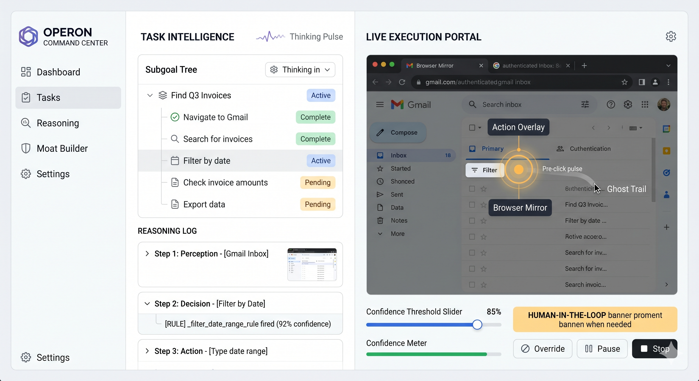

<div align="center">


# Operon

**A zero-abstraction, vision-first computer-use agent.**  
No DOM. No selectors. No accessibility tree. Just pixels.

[](https://www.python.org/)
[](LICENSE)
[](https://github.com/vickey-kapoor/Operon/actions)
[](https://github.com/vickey-kapoor/Operon/pulls)



</div>

---

## What is Operon?

Operon is a clinical, execution-only computer-use engine. It perceives the world as raw pixels and operates exclusively in coordinate space — the same way a human does. Every run is a direct march toward a visually confirmed terminal state.

It works on **any surface**: web apps, desktop applications, internal tools, legacy systems. If a human can see it, Operon can use it.

```
capture → perceive → decide → execute → verify → recover
```

---

## Why Vision-Only?

| Traditional Automation | Operon |
|---|---|
| Anchors to CSS selectors, XPath, element IDs | Anchors to pixel coordinates |
| Breaks on UI redesigns or framework migrations | Works on any rendered surface |
| Requires DOM access — web only | Works on desktop, browser, legacy apps |
| Brittle to dynamic class names | Stable to visual layout |

---

## Key Capabilities

- **Pure vision perception** — Gemini perceives the screen and returns typed `ScreenPerception` objects (coordinates, page hints, element types). Zero DOM interaction.
- **Rule-Augmented Generation** — `PolicyRuleEngine` runs deterministic checks before every LLM call. Fired rule names are stamped and injected into the next prompt as a RAG trace.
- **Confidence-gated autonomy** — Set an autonomy threshold in the UI. When `PolicyDecision.confidence` drops below it, the agent pauses and surfaces the decision for human approval or correction.
- **Spatial persistence** — `RollingElementBuffer` (3-frame rolling cache) tracks coordinates across steps. Elements absent for >2 frames become `GhostElement`s — occluded, not gone.
- **Visual servo** — Before every click, a 100×100px crop is variance-checked. Uniform regions (target shifted or disappeared) are rejected and logged as `CoordDriftWarning`. Never fires blind.
- **Adaptive stall detection** — Screen-change ratio measured after each action. <1% change over 2+ consecutive steps triggers a subgoal reset and forces a new strategy.
- **Reaction-check verification** — `VideoVerifier` sends before/after frames to Gemini to detect micro-reactions (ripple, focus ring, spinner). Returns `PROGRESSING_STABLE` → advance immediately.
- **Self-improving memory** — `PostRunReflector` writes `MemoryHint`s on every run. Successful trajectories are compressed into reusable `Episode`s. Hints decay geometrically on failure.
- **Human-in-the-loop** — CAPTCHA, login, 2FA, or bot-detection triggers a UI pause with a Windows/macOS/Linux notification, a live screenshot overlay, and a correction hint input.

---

## Architecture

```
FastAPI  ──▶  AgentLoop
                ├── Capture    mss / Playwright burst (3 frames, velocity-checked)
                ├── Perceive   Gemini → ScreenPerception + coord smoothing + ghost detection
                ├── Decide     PolicyCoordinator
                │               ├── PolicyRuleEngine   (deterministic, named rules)
                │               ├── GeminiPolicyService (LLM fallback)
                │               └── Rule-Augmented Generation trace injected into next prompt
                ├── Execute    DesktopExecutor (adaptive servo) │ NativeBrowserExecutor
                ├── Verify     DeterministicVerifier
                │               ├── Terminal state check (visual predicate, fires first)
                │               ├── Reaction check  (VideoVerifier, multi-image)
                │               ├── STABLE_WAIT     (200ms re-verify on UI motion)
                │               └── PENDING         (page loading, 2–8s backoff)
                ├── Recover    RuleBasedRecoveryManager
                ├── Reflect    PostRunReflector  (terminal only)
                └── Persist    FileBackedRunStore + RollingElementBuffer + MemoryStore

SSE  /command-center/api/run/{id}/stream ──▶ Command Center (split-pane HTML+JS)
WebSocket (port 9001)                    ──▶ Control messages + binary CDP frames
```

---

## Quick Start

**Requirements:** Python 3.11, Windows/macOS/Linux, Chrome (for browser mode)

```powershell
# 1. Create virtual environment
py -3.11 -m venv .venv
.\.venv\Scripts\Activate.ps1

# 2. Install dependencies
pip install -e .[dev]
playwright install chromium

# 3. Configure API key
copy .env.example .env
# Set GOOGLE_API_KEY or GEMINI_API_KEY in .env

# 4. Start the server
python -m uvicorn src.api.server:app --host 127.0.0.1 --port 8080
```

Open **http://localhost:8080** — redirects automatically to the split-pane Command Center.

---

## Command Center UI

Open **http://localhost:8080** — redirects automatically to the split-pane Command Center.

```
┌─────────────────────────────┬──────────────────────────────────────────┐
│  STEP STREAM  42%           │  LIVE BROWSER  58%                       │
│                             │                                          │
│  ● step 1  click  0.92 ──   │  ┌──────────────────────────────────┐   │
│  ● step 2  type   0.87 ──   │  │                                  │   │
│  ● step 3  nav    0.95 ──   │  │   live 2Hz screenshot            │   │
│  ◌ step 4  …               │  │   (CDP screencast / polling)     │   │
│                             │  │                                  │   │
│  source: LLM │ Rule         │  └──────────────────────────────────┘   │
│  conf: ████░  0.87          │                                          │
│  expects: content           │  ● WS  0.0 fps  ■ pause               │
└─────────────────────────────┴──────────────────────────────────────────┘
         [+ new task]   run: abc12345 · 00:32 · running
```

| Pane | What's in it |
|---|---|
| **Step Stream** (42%) | Live SSE feed of every agent step — action type, source (LLM or rule name), confidence, expected change, pass/fail status |
| **Live Browser** (58%) | 2Hz screenshot polling at `/command-center/api/run/{id}/screenshot`; switches to CDP screencast when `OPERON_COMMAND_CENTER_MODE=true` |

### New Task Modal

Click **+ new task** in the topbar (or any recent-run row to retry with pre-filled intent).

| State | What you see |
|---|---|
| **Default** | Browser / Desktop toggle, instruction textarea, optional start URL (browser only) |
| **Loading** | Spinner + Cancel button (AbortController wired) |
| **Error** | Inline banner with server message; URL field highlighted if URL-related |
| **Blocked** | Run already active — shows active run ID + elapsed time, **Stop current run** button to unblock |

---

## Configuration

| Variable | Default | Purpose |
|---|---|---|
| `GOOGLE_API_KEY` / `GEMINI_API_KEY` | — | Gemini API (required) |
| `ANTHROPIC_API_KEY` | — | Claude planner / verifier (optional) |
| `OPERON_BROWSER_BACKEND` | `computer_use` | `computer_use` or `json` |
| `OPERON_DESKTOP_BACKEND` | `json` | Desktop perception + policy mode |
| `OPERON_BROWSER_PLANNER_PROVIDER` | `gemini` | `gemini` or `anthropic` |
| `OPERON_DESKTOP_PLANNER_PROVIDER` | `gemini` | `gemini` or `anthropic` |
| `BROWSER_HEADLESS` | `false` | Headless Playwright |
| `OPERON_COMMAND_CENTER_MODE` | `false` | Adds `--remote-debugging-port=9222` for CDP attach |
| `OPERON_TRACE` | — | `1` enables `[TRACE]` loop events |
| `OPERON_TEST_SAFE_MODE` | `false` | Skip display baseline in tests |

---

## API

```
# Run lifecycle
POST /run-task                                    Start a browser run
POST /desktop/run-task                            Start a desktop run
POST /step                                        Advance one step
POST /resume                                      Resume a HITL-paused run
POST /stop                                        Cancel (body: run_id)
POST /run/{id}/stop                               Cancel by path
POST /run/{id}/pause                              Pause by path (→ WAITING_FOR_USER)
GET  /run/{id}                                    Read run state
GET  /health                                      Health check

# Command Center
GET  /command-center                              Split-pane UI (HTML)
GET  /command-center/{run_id}                     Same UI, run_id is client-side state
GET  /command-center/api/run/{id}/stream          SSE step stream (tails run.jsonl)
GET  /command-center/api/run/{id}/screenshot      Latest step screenshot (2Hz polling target)

# Observer
GET  /observer/api/runs                           Recent runs list
GET  /observer/api/run/{id}                       Full run snapshot + artifacts
GET  /observer/api/artifact                       Serve step artifact files
GET  /observer/api/usage                          Token usage dashboard
```

---

## Testing

```powershell
# Unit + integration tests (no live server required)
$env:GEMINI_API_KEY = "fake-test-key"
python -m pytest tests -q `
  --ignore=tests/test_e2e_quick_tasks.py `
  --ignore=tests/test_bug_fixes_verification.py

# Single file
python -m pytest tests/test_agent_loop.py -q

# Lint
ruff check src tests --select E,F,W,I --ignore E501
```

---

## Project Layout

```
src/
  agent/      loop.py, perception.py, policy_coordinator.py, policy_rules.py,
              policy.py, verifier.py, video_verifier.py, recovery.py,
              reflector.py, selector.py, capture.py, hitl.py,
              screen_diff.py, action_translation.py, backend.py,
              benchmark.py, screen_recorder.py
  executor/   desktop.py, browser_native.py, browser_adapter.py,
              desktop_adapter.py, os_picker_macro.py
  api/        server.py, routes.py, observer.py, command_center.py, runtime_config.py,
              static/ (command-center, console, dashboard, benchmarks)
  clients/    gemini.py, anthropic.py, gemini_computer_use.py
  models/     state.py, perception.py, policy.py, execution.py,
              verification.py, recovery.py, memory.py, logs.py, common.py
  store/      run_store.py, memory.py, run_logger.py, background_writer.py
  runtime/    orchestrator.py, state.py, legacy_adapter.py, benchmark_runner.py
  benchmarks/ registry.py, form_plugin.py, webarena.py, …
  core/       contracts/, router.py
ui/           React 19 Command Center (Vite + Zustand 5 + react-resizable-panels)
prompts/      policy_prompt.txt, perception_prompt.txt, critic_prompt.txt,
              video_verification_prompt.txt, reaction_check_prompt.txt, …
runs/<run_id>/   state.json, run.jsonl, step_N/ (screenshots + all model I/O)
memory/          memory.jsonl, episodes.jsonl
```

---

## Roadmap

- [ ] Claude Computer Use backend for browser perception
- [ ] WebArena medium/hard benchmark suite
- [ ] Prompt caching (Vertex AI context cache for static prefixes)
- [ ] Tauri desktop app packaging
- [ ] Multi-monitor support

---

<div align="center">

Built with [Gemini](https://deepmind.google/technologies/gemini/) · [FastAPI](https://fastapi.tiangolo.com/) · [Playwright](https://playwright.dev/) · [React 19](https://react.dev/)

</div>
