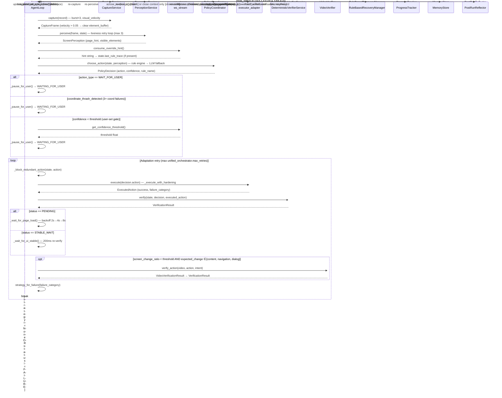

# Persistent Browser Sessions and the End of Cold-Start Tax in Multi-Task Benchmarks

**Operon Engineering Notes — Week of 2026-05-10**

## Architectural Win of the Week

The most consequential structural change this week was the split of `NativeBrowserExecutor._ensure_session()` into two distinct lifecycle paths: `_ensure_session_batch()` and `_ensure_session_observable()` (`src/executor/browser_native.py`, commits `60ed37d`, `92edb9c`).

Previously, every run — regardless of whether it was part of a benchmark suite or a one-off task — launched a fresh Chromium instance, waited for it to hydrate (the 2.5s bootstrap warmup in `loop.py:step_run`), ran its task, and then tore down the entire Playwright stack: `context.close()` → `browser.close()` → `playwright.stop()`. For single tasks this is fine. For a 10-task benchmark suite running sequentially on the same host, it means 10 cold-starts, 10 Chromium launches, and — critically — 10 complete auth-state resets. Any benchmark flow requiring authenticated sessions (WebArena's GitLab tasks being the canonical example) had to re-authenticate from scratch on every task, burning multiple steps just to get back to the starting line.

Observable mode closes this gap. When a run is created with `mode=observable`, `_ensure_session_observable()` launches Chromium once and stores the live instance in `self._obs_playwright` / `self._obs_browser`. Every subsequent observable task calls `browser.new_context()` on the already-running instance — a millisecond operation — rather than launching a new process. When a task ends, `_close_session(observable=True)` closes only the `context`, leaving the browser process alive. The `mode` field flows all the way from `RunTaskRequest.mode` → `AgentLoop.start_run()` → `executor.configure_run(mode=record.mode)` → `NativeBrowserExecutor._run_mode` dict → the session branch point. Explicit teardown of the persistent instance lives in `close_persistent_browser()`, now called by `POST /disconnect-cdp` so the user can reset the observable session from the UI.

The benchmark runner (`src/api/benchmark_suite.py`) was updated in `92edb9c` to thread `mode` through `run_suite_background()` and both benchmark route handlers, meaning a single `mode=observable` flag in the suite request propagates to every task without per-task configuration. Live validation against wa_001 + wa_002 on the same PID/wsURL confirmed both tasks shared the same Chromium process — wa_001 completed in 6 steps, wa_002 in 9, with no re-authentication overhead.

## What Shipped

### Policy / Rule Engine

- `e8a8277` — **Fix: `_search_query_rule` perpetual TYPE loop.** When the rule fired `TYPE + press_enter` and `page_hint` did not advance on the next step, the rule previously fell through to the search-input branch and typed the same query again, looping until `_no_progress_recovery_rule` eventually cut in (typically 5–7 wasted steps). The fix: if `last_rule_trace` contains `_search_query_rule` with `action=type`, the rule now skips directly to the direct-URL navigate fallback. The fallback includes site-specific URL construction for wikipedia.org (`/w/index.php?search=`) and github.com (with language/star-count extraction from the query string). Closes the loop after one failed Enter.

- `7be619a` — **`_dropdown_menu_select_rule` desktop-context guard.** Added `_BROWSER_HINT_TOKENS` frozenset and a guard: the rule only fires on native desktop pages when `AgentState.menu_is_active` is True. This was misfiring on Notepad's format toolbar — buttons in the toolbar were being identified as open dropdown menus, causing the rule to issue incorrect child-item selection actions.

- `7be619a` — **`_dismiss_blocking_overlay_rule` intent-target exemption.** The rule now checks overlay `primary_name` and `element_id` tokens against the intent. If an overlay's name appears in the intent (e.g., "Notepad" when intent is "open Notepad and write code"), it is skipped. Without this, the Notepad application window itself was being treated as a blocking overlay requiring dismissal.

- `7be619a` — **Policy coordinator misfire hint refinement.** The recovery advisory for off-target clicks now explicitly says "do NOT click the taskbar or system tray" — grounding the LLM recovery toward the application window rather than allowing it to repeat the same erroneous taskbar click.

### Agent Loop

- `7be619a` — **Confidence-gated autonomy.** `AgentLoop.step_run()` now checks `ws_stream.get_confidence_threshold()` after policy decides an action. If `decision.confidence < threshold` (user-configurable via the Command Center slider), the loop substitutes a `WAIT_FOR_USER` action and calls `_pause_for_user()`, surfacing the planned action type and confidence score to the human. On resume, any correction hint sent via the WebSocket `override` control message is consumed at the top of the next step and injected into `state.last_rule_trace` so the LLM planner sees it as a first-class advisory.

- `60ed37d` — **Observable mode propagation.** `loop.start_run()` now passes `record.mode` through `executor.configure_run()`. This was the missing link between the `RunTaskRequest.mode` field (added in `d335452`) and the executor's session branching logic.

### Executor

- `60ed37d` — **`NativeBrowserExecutor` session split.** `_ensure_session_observable()` and `_ensure_session_batch()` replace the previous monolithic `_ensure_session()`. `_attach_page_listeners()` extracted as a shared helper (console log, network failure, dialog capture), called by both paths. `_close_session()` gains an `observable` kwarg; `close_persistent_browser()` added as the explicit teardown path.

- `9e0acba` — **CDP port unconditionally exposed.** Removed the `OPERON_COMMAND_CENTER_MODE` env-var gate from `browser_native.py`. `--remote-debugging-port=9222` is now always passed at Chromium launch. `BrowserManager.connect()` can now attach for live CDP streaming on any run without requiring a separate env-var toggle.

### API / Command Center

- `7be619a` — **WebSocket control plane.** `src/api/ws_stream.py` introduced: pub/sub for step events, binary JPEG frames, HITL state, element bounds. Control message handlers: `set_confidence_threshold`, `set_disabled_rules`, `override` hint injection, `resume`. `PolicyRuleEngine` now checks `ws_stream.get_disabled_rules()` before each engine primitive fires — individual rules can be toggled off at runtime without restarting the server.

- `e8d07e7` — **Command Center split-pane UI.** Server-Sent Events endpoint (`GET /command-center/api/run/{id}/stream`) tails `run.jsonl` with a 15s heartbeat. New-task modal: browser/desktop toggle, URL validation, AbortController cancel, 409 blocked state, stop-current-run flow. Screenshot endpoint at 2Hz. Redirect `/` → `/command-center` (307).

### Infrastructure

- `002afb6` — **Test package reorganization.** `tests/` split into `agent/`, `api/`, `executor/`, `store/` subpackages. `src/runtime/legacy_adapter.py` → `adapter.py`; `src/runtime/state.py` → `runtime_state.py`. Static HTML moved to subdirectories. `src/store/cost.py` stub added for future run-level cost aggregation.

## Architecture

`src/agent/loop.py` was modified in commits `7be619a`, `60ed37d`, `002afb6`, and `d335452`. The sequence diagram below reflects the current step logic, including the three new pause gates added this week.

## Cold Post-Mortem

**`last_rule_trace` string-matching brittleness** — The `_search_query_rule` fix in `e8a8277` parses `last_rule_trace` via substring matching (`"_search_query_rule" in _last_trace and "action=type" in _last_trace`). The trace is a human-readable formatted string, not structured data. Any future change to the trace format (e.g., renaming the action field or adjusting the format string in `loop.py:783-788`) will silently break the rule's loop-detection logic. The rule will revert to typing the same query again without warning. Severity: **degraded** (affects search task completion; no data loss).

**CDP port 9222 single-occupancy constraint** — `NativeBrowserExecutor` binds `--remote-debugging-port=9222` unconditionally. A second concurrent observable run on the same host will fail to bind the port. The batch path has the same constraint. This is documented in the commit message but is a hard operational limit: parallel benchmark suites on a single machine require port-0 allocation with dynamic port discovery (not yet implemented). Severity: **degraded** for parallel workloads; **blocking** if someone attempts concurrent observable runs.

**Confidence gate circular import** — `loop.py` imports `src.api.ws_stream` inside `step_run()` via a local `try/except ImportError` guard (lines 496-500). The core execution loop now has an optional runtime dependency on the API layer. If the API layer ever changes its import path or if `ws_stream` is restructured, the gate silently degrades to no-op (threshold = 0.0). The correct design is dependency injection: pass the threshold as a callable or observer into `AgentLoop.__init__`. Severity: **cosmetic** until the dependency graph grows further.

**CDP Page.screencast not yet implemented** — Two `TODO` comments in `src/api/static/command-center/index.html` (lines introduced in `e8d07e7`) note that the 2Hz screenshot polling endpoint should be replaced with `CDP Page.screencast` WebSocket for lower-latency streaming. The current path is: browser renders → Playwright captures PNG → API serves JPEG → Command Center polls every 500ms. Estimated additional latency vs. screencast: 300-600ms. Severity: **cosmetic** (functional, but perceptibly laggy for monitoring fast-moving tasks).

**`src/store/cost.py` stub** — Added in `002afb6` as a 10-line file with placeholder content. Run-level cost aggregation (token counts × model pricing) is not functional. Severity: **cosmetic** (no user-visible impact; cost data is available in per-step usage artifacts but not aggregated).

**`_BROWSER_HINT_TOKENS` context detection fragility** — The dropdown rule's browser/desktop discrimination uses `any(tok in hint_val for tok in self._BROWSER_HINT_TOKENS)` where tokens are `{"page", "browser", "search", "form", "article", "login", "web", "site"}`. A desktop app with a page_hint that happens to contain "page" (e.g., `"home_page"`) will be incorrectly classified as a browser context and the `menu_is_active` gate will be skipped. Not yet observed to cause failures in current benchmarks but will require refinement as the desktop benchmark suite expands. Severity: **degraded** (latent).

## What's Next

The most important open problem is eliminating the CDP port 9222 single-occupancy constraint, which currently prevents parallel observable-mode runs and limits throughput on multi-machine benchmark infrastructure. The path forward — port-0 allocation at launch with dynamic port storage in `_run_mode` — also sets up the groundwork for proper parallel suite execution.
