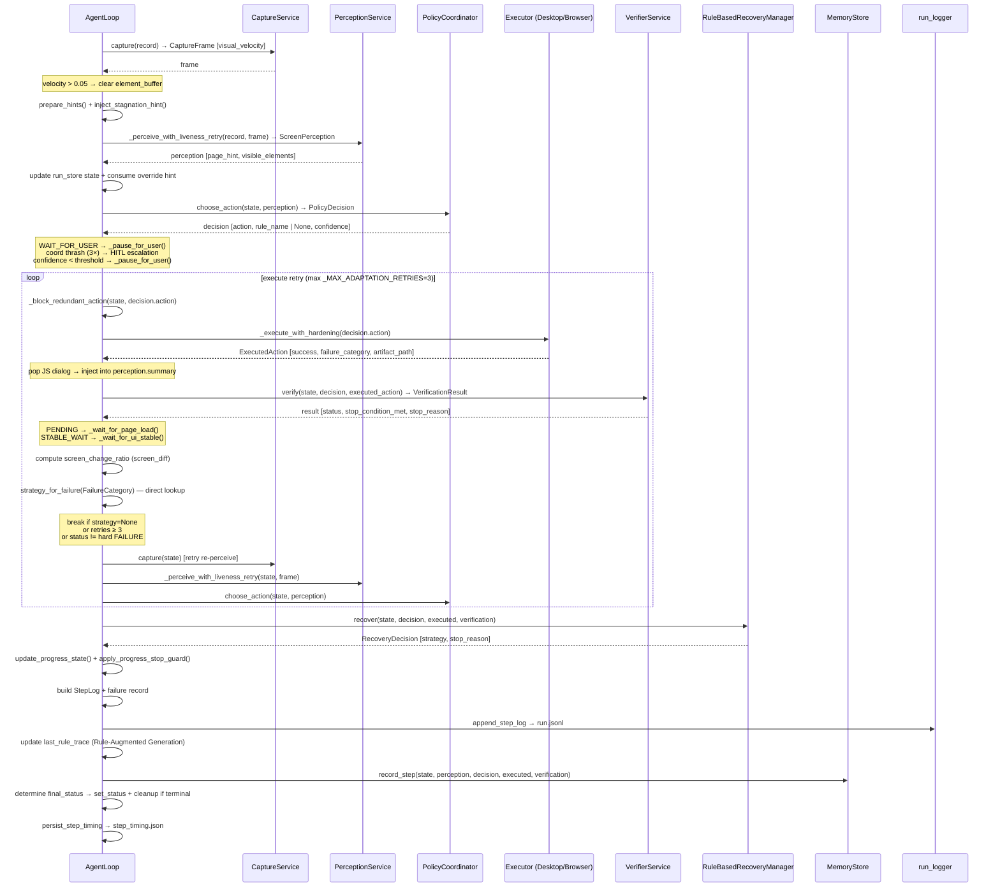

# Dropping the Contract Bus: 5,200 Lines Out, Loop.py at Its Tightest

**Operon Engineering Notes — Week of 2026-05-17**

## Architectural Win of the Week

The centerpiece this week is commit `0ce79c0`: the complete removal of `src/runtime/` — `UnifiedOrchestrator`, `LegacyOperonContractAdapter`, `AgentRuntimeState`, and `Phase5BenchmarkRunner` — plus three satellite components: `src/agent/video_verifier.py`, `src/agent/reflector.py`, and `src/agent/anchor_cache.py`. Combined, the diff is −5,277 lines across 27 files, and 7 test files dropped entirely.

**Why the old contract bus was fragile:** By the time it was removed, the runtime layer had already been demoted to "observability-only" in the loop itself. The code comment said it plainly: *"The unified contract conversion below is now observability-only — kept so benchmark_runner can read retry_count/last_failure_type via unified_state_for_run()."* The entire `LegacyOperonContractAdapter` translation — re-constructing `AgentState`/`ScreenPerception`/`PolicyDecision`/`ExecutedAction`/`VerificationResult` into a `LegacyContractBundle` via Pydantic on every step — ran inside a `try/except (RoutingError, ValueError)` that silently continued on failure. Critically, the in-step retry budget was gated on `self.unified_orchestrator.max_retries`, a property lookup on an external singleton. If the contract conversion threw and was silently swallowed, the retry count could diverge from the orchestrator's view of the world with no log entry. After removal, the retry cap is `_MAX_ADAPTATION_RETRIES = 3` — a local constant in the execute loop in `loop.py:595`. `strategy_for_failure()` is called directly on `FailureCategory` with no routing layer in between. The per-run `unified_states` dict is gone.

**VideoVerifier removal** is the latency win: `_maybe_video_verify()` added +5–8 seconds to any step where `screen_change_ratio < SCREEN_CHANGE_THRESHOLD` and `expected_change ∈ {CONTENT, NAVIGATION, DIALOG}`. It recorded a 3-second clip via `execute_with_recording`, re-executed the action (itself unsafe for TYPE/DRAG/SELECT — hence the 180-line gating block), and made a second Gemini call. In practice, the slow second opinion arrived at the same conclusion the `RuleBasedRecoveryManager` would reach anyway. Uncertain steps now fall through directly to recovery, saving 5–8 seconds per uncertain step at the cost of no behavioral change in the happy path.

**AnchorCache removal** eliminated a policy-layer workaround for an execution-layer invariant. The cache (`src/agent/anchor_cache.py`) snapped TYPE target coordinates back to "last confirmed click anchor when drift < 5px" — but `_region_has_content()` already aborts clicks on uniform-variance regions before any cursor movement occurs. The anchor cache was correcting drift after the visual servo had already detected and reported it. Removing it also excised a subtle shadow-variable bug: `_anchor_snap_info` was set both in the main execution path and in the per-retry path (`_retry_snap`), with the retry value potentially overwriting the outer assignment silently.

## What Shipped

**API / Run Lifecycle**

- `d127969` — **Cancelled run cleanup gap closed.** `_cleanup_completed_run()` was only invoked from inside the auto-run loop's terminal handler. A run cancelled via `POST /stop` while paused in HITL (no active auto-run task) never triggered cleanup: browser sessions stayed open, temp files accumulated. Now both stop endpoints (`stop_run`, `stop_run_by_id`) call the new `_cleanup_cancelled_run()` helper, guarded by a `cancelled_now` flag to keep the calls idempotent.

- `214819f` — **Auto-run task deduplication.** `POST /run-task` and `POST /resume` each used bare `asyncio.create_task()` with no registry. Client retries or double-submits spawned multiple concurrent tasks driving the same `run_id` through `AgentLoop.run_step()` with no step-level synchronization. Replaced with `_schedule_auto_run()`: a module-level `_auto_run_tasks: dict[str, asyncio.Task]` dict, a deduplication check (`if existing and not existing.done()`), a done-callback that removes the entry on completion, and `_cancel_auto_run()` that awaits cancellation before cleanup proceeds.

- `de822e7` — **Test safe mode browser isolation.** `_ensure_cdp_ready()` and `asyncio.create_task()` (auto-run scheduling) were not gated on `OPERON_TEST_SAFE_MODE`. Tests that exercised the run-task endpoint could trigger real Playwright browser startup or schedule background coroutines that outlived the test, poisoning the event loop for subsequent tests. Both paths are now guarded by `_test_safe_mode_enabled()`.

**Execution**

- `61908ab` — **mss 10 constructor migration.** mss 10 deprecates `mss.mss()` in favour of `mss.MSS`. All 6 call sites in `src/executor/desktop.py` now go through a `_mss()` helper: `factory = getattr(mss, "MSS", mss.mss)`. This eliminates deprecation warnings in production logs and is forward-compatible with mss 11 should `mss.mss` be removed.

**Policy / Backends**

- `04242f1` — **Advisory hints scoped by run.** `BrowserComputerUseBackend._advisory_hints` was a flat `list[tuple[str, str]]` shared across all concurrent runs. A hint added for run A (e.g. a memory-decay hint from `add_advisory_hints(source="rule_trace")`) could be consumed by run B's `_render_prompt()` if B executed first. Promoted to `dict[str, list[tuple[str, str]]]` keyed by `run_id`. `FallbackBackend._clear_inactive_hints()` and `add_advisory_hints()` now propagate `run_id` through the full call chain. `clear_advisory_hints()` signature gains `run_id: str = ""` on the `AgentBackend` ABC.

**Dependencies**

- `0223192` — **Major dep bumps.** Pillow 12, mss 10, Vite 8, TypeScript 6, google-genai 2.x, cryptography 48. Vite 8 switches minifier to oxc and build target to es2022/chrome120. esbuild added as an explicit devDependency (required by Vite 8).

**Docs / CI**

- `c591999` / `aa054ec` — Python 3.14 CI targets, pytest-asyncio constraint updated for 3.14 compatibility.
- `1a846c4` / `c2f0fa1` — Pruned stale runtime/benchmark references from README and docs. 7,283 lines of historical docs deleted.

## Architecture

`loop.py` was modified significantly this week (removal of VideoVerifier, AnchorCache, and all runtime contract call sites). The current step sequence:

Notable: step 7 "Video verify" and step 11 "Reflect" from the previous architecture no longer exist. The execute loop retries up to 3 times on hard `FAILURE` status using a direct `FailureCategory → RecoveryStrategy` mapping. No contract bus, no `AgentRuntimeState`, no per-step Pydantic translation overhead.

## Cold Post-Mortem

**Advisory hint cross-contamination** — Before `04242f1`, `BrowserComputerUseBackend._advisory_hints` was a flat list with no run_id scoping. In any scenario with concurrent browser runs, hints from run A were consumable by run B's `_render_prompt()` call. The failure mode is silent: the wrong hint block appears in the prompt, producing unexpected policy decisions with no error, no log line, no verification failure. Root cause: the `add_advisory_hints` / `clear_advisory_hints` API on `AgentBackend` had no run identity. Severity: **degraded** (behavior drift in multi-run server sessions).

**Auto-run task accumulation** — Before `214819f`, every call to `POST /run-task` or `POST /resume` spawned an untracked `asyncio.create_task()`. A client retry or double-resume created two concurrent coroutines calling `AgentLoop.run_step()` for the same `run_id` with no synchronization. `AgentLoop.run_step()` is not re-entrant: it reads and writes `AgentState` via `run_store.update_state()` without a per-run lock. Root cause: no task registry. Severity: **degraded** (duplicate actions, racing state updates, corrupted `step_count`).

**Cancelled run cleanup gap** — Before `d127969`, `_cleanup_completed_run()` was only reached when the auto-run loop itself hit a terminal state. A run cancelled externally while paused in HITL (where no auto-run task is spinning) silently leaked browser sessions and temp files. Root cause: cleanup was coupled to the run loop's exit path rather than to the run's status transition. Severity: **degraded** (accumulating resource leak over long server uptime).

**CLAUDE.md documents components that no longer exist** — `VideoVerifier` (line 119), `PostRunReflector` (lines 123, 258, 331), `AnchorCache` (line 135), `UnifiedOrchestrator` / `LegacyOperonContractAdapter` / `AgentRuntimeState` (lines 173–181), and `src/runtime/` as an active package are all described as present in CLAUDE.md. All were removed in `0ce79c0` (May 14). A contributor reading the documented core loop sequence will find steps 7 and 11 that do not exist in code. The retry budget source documented as `unified_orchestrator.max_retries` is now a local constant. Root cause: the cleanup PRs updated code and removed archive docs but did not update CLAUDE.md. Severity: **cosmetic for runtime, high friction for onboarding**.

**Episode extraction disabled, memory system partially regressed** — `PostRunReflector._extract_episode()` and `_filter_one_shot_steps()` were the only mechanism writing `memory/episodes.jsonl` — compressed optimal-trajectory records for reuse across runs. Both are gone. The memory system now writes per-step `MemoryRecord` entries with geometric weight decay, but no longer consolidates successful runs into reusable episodes. `FileBackedMemoryStore.get_hints()` still reads and prunes records by weight, but the signal quality degrades as individual step records accumulate without trajectory-level compression. Root cause: reflector removed as part of the complexity purge without a replacement episode writer. Severity: **cosmetic** (episode replay was not on the active execution path), but represents an intentional regression in the memory system's design.

## What's Next

CLAUDE.md is now a misleading document: it accurately describes four components (VideoVerifier, PostRunReflector, AnchorCache, the entire runtime package) that were removed ten days ago while a contributor reading it would build an incorrect mental model of the loop's step count, retry budget, and memory system. The highest-priority follow-up is a CLAUDE.md pass that replaces the 12-step loop description with the current 8-stage sequence, removes the `src/runtime/` section, and updates the memory system docs to reflect the absence of episode extraction.
